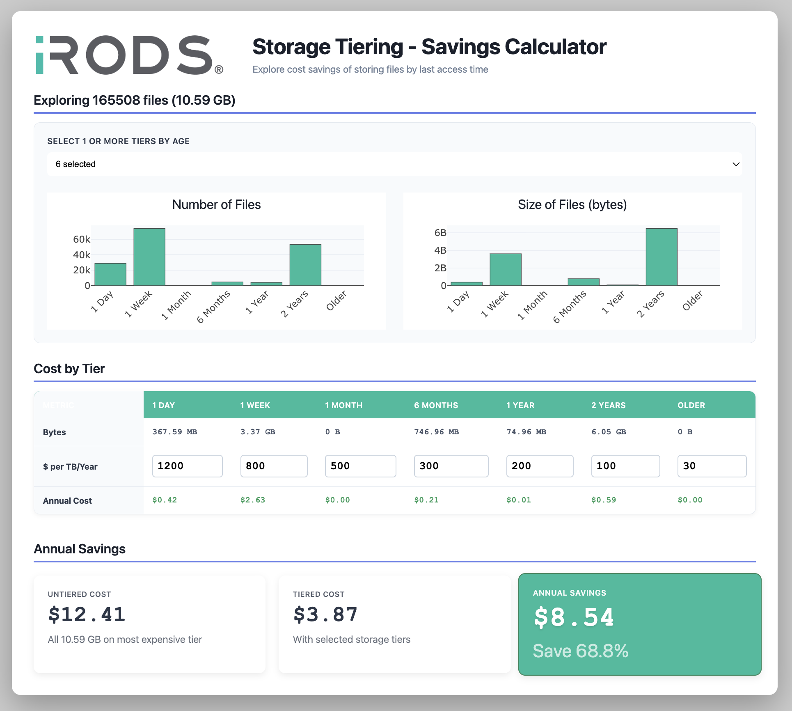

# iRODS Storage Tiering - Savings Calculator

Run the savings calculator against a local directory.

```
./run_savings_calculator.sh <local_directory>
```

Open http://localhost:8000.

Investigate savings.

## Screenshot


